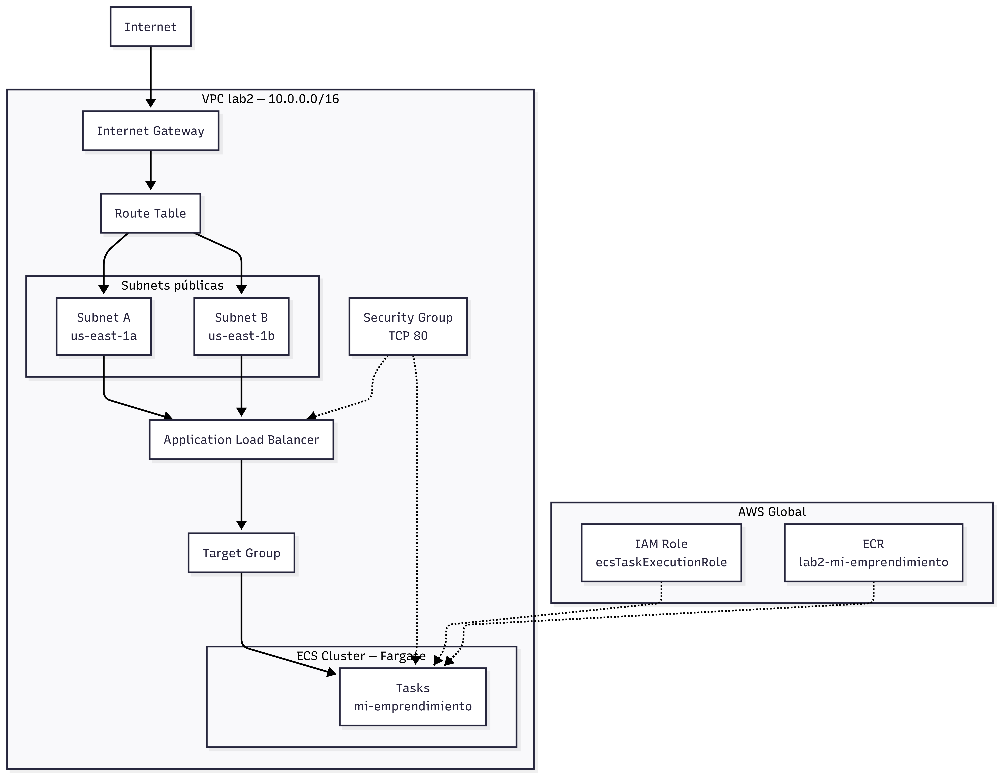
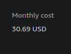
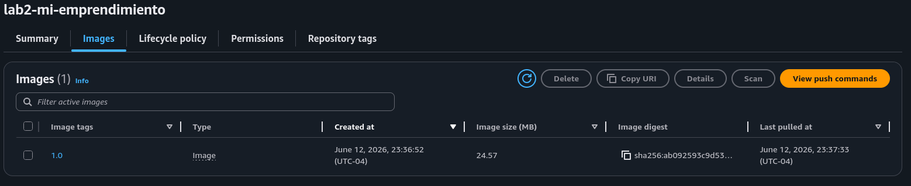
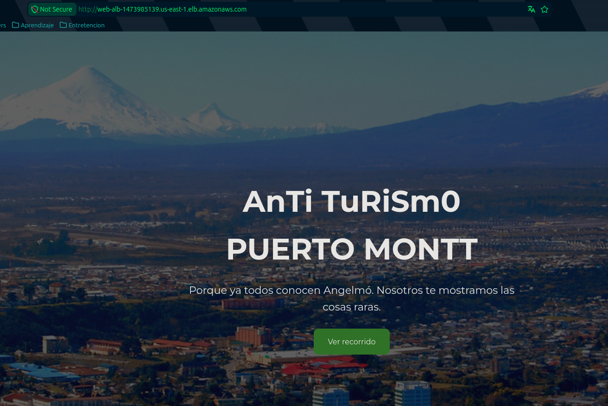
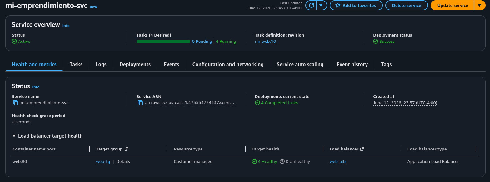

## a) Diagrama de infraestructura



## b) Justificación técnica

### Creación de rol IAM

- En esta sección analizamos si existe un rol IAM con los permisos necesarios para ejecutar las tareas de ECS. En caso de no existir, se crea un nuevo rol con la siguiente política de confianza:
- El rol esta definido por el siguiente JSON:

```json
{
  "Version": "2012-10-17",
  "Statement": [
    {
      "Effect": "Allow",
      "Principal": { "Service": "ecs-tasks.amazonaws.com" },
      "Action": "sts:AssumeRole"
    }
  ]
}
```

### Creación de VPC y Subnets

- Creamos una VPC con el siguiente comando:

```bash
VPC_CIDR="10.0.0.0/16"
export VPC_ID=$(aws ec2 create-vpc \
    --cidr-block $VPC_CIDR \
    --query 'Vpc.VpcId' --output text)
```

- Se eligió el bloque CIDR `10.0.0.0` ya que es un bloque privado que no se superpone con la mayoría de las redes públicas, lo que reduce el riesgo de conflictos de IP al conectar con otras redes o servicios en la nube.
- El bloque CIDR `/16` proporciona un rango amplio de direcciones IP (más de 65000) para acomodar múltiples subredes, instancias y servicios dentro de la VPC, lo que es ideal para un proyecto de este calibre.

- Se crean 2 SUBNETS con los siguientes comandos:

```bash
export SUBNET_PUB_A=$(aws ec2 create-subnet\
    --vpc-id $VPC_ID \
    --cidr-block 10.0.1.0/24 \
    --availability-zone ${REGION}a \
    --query 'Subnet.SubnetId' \
    --output text)

export SUBNET_PUB_B=$(aws ec2 create-subnet\
    --vpc-id $VPC_ID \
    --cidr-block 10.0.2.0/24 \
    --availability-zone ${REGION}b \
    --query 'Subnet.SubnetId' \
    --output text)

```

- Las subnets tienen distintas `availability-zone` para garantizar disponibilidad y tolerancia a fallos. Si una zona de disponibilidad experimenta problemas, las instancias en la otra zona pueden seguir funcionando sin interrupciones.

- Las subnet obtienen acceso a internet gracias al `Internet Gateway` y la `Route Table`

```bash
export IGW_ID=$(aws ec2 create-internet-gateway \
  --query 'InternetGateway.InternetGatewayId' \
  --output text)
export RT_ID=$(aws ec2 create-route-table \
  --vpc-id $VPC_ID --query 'RouteTable.RouteTableId' --output text)

aws ec2 associate-route-table --route-table-id $RT_ID --subnet-id $SUBNET_PUB_A
aws ec2 associate-route-table --route-table-id $RT_ID --subnet-id $SUBNET_PUB_B

```

### Security Group

- Creamos security group y lo asociamos a la VPC

```bash
export SG_ID=$(aws ec2 create-security-group \
    --group-name lab2-security-group \
    --description "lab SG" \
    --vpc-id $VPC_ID \
    --query 'GroupId' \
    --output text)
```

- Se agregan reglas para permitir tráfico HTTP (puerto 80)

```bash
aws ec2 authorize-security-group-ingress \
    --group-id $SG_ID \
    --protocol tcp \
    --port 80 \
    --cidr 0.0.0.0/0
```

- En esta ocasión no se usó una regla para permitir tráfico SSH, ya que no es necesaria.

### Target Group y Application Load Balancer

- El Target Group es el grupo de destinos al cual el balanceador enviará tráfico.
- Se crea con el siguiente comando:

```bash
export TG_ARN=$(aws elbv2 create-target-group \
  --name web-tg \
  --protocol HTTP --port 80 \
  --target-type ip \
  --vpc-id $VPC_ID \
  --health-check-path / \
  --query 'TargetGroups[0].TargetGroupArn' --output text)
```

- Se utiliza `--target-type ip` porque Fargate exige este tipo.
- El health check se configura para verificar la salud de las tareas, asegurando que solo las instancias saludables reciban tráfico.
- Al Application Load Balancer (ALB) se le asigna el Target Group generado anteriormente y las 2 subnets publicás.
- Se crea el ALB con el siguiente comando:

```bash
export ALB_ARN=$(aws elbv2 create-load-balancer \
  --name web-alb \
  --subnets $SUBNET_PUB_A $SUBNET_PUB_B \
  --security-groups $SG_ID \
  --scheme internet-facing \
  --query 'LoadBalancers[0].LoadBalancerArn' --output text)
```

- El ALB tiene un DNS público accesible desde internet. Todo el tráfico HTTP del sitio pasa por aquí.

- Finalmente se crea el listener con el siguiente comando:

```bash
aws elbv2 create-listener \
  --load-balancer-arn $ALB_ARN \
  --protocol HTTP --port 80 \
  --default-actions Type=forward,TargetGroupArn=$TG_ARN
```

- El listener escucha el puerto 80 y reenvía el tráfico, sin el el ALB no sabe dónde enviar el tráfico.

### Cluster ECR

- Generamos un repositorio ECR para almacenar la imagen Docker.

```bash
export ECR_URI=$(aws ecr create-repository \
    --repository-name $REPO_NAME \
    --image-scanning-configuration scanOnPush=true \
    --query 'repository.repositoryUri' \
    --output text)
```

- Luego buildeamos la imagen Docker

```Dockerfile
FROM nginx:1.27-alpine
COPY . /usr/share/nginx/html
```

- Notar que usamos una versión específica y liviana.
- Esta imagen es pusheada al repositorio ECR para usarla despúes.

```bash
docker tag $APP:$SEMANTIC_VERSION $ECR_URI:$SEMANTIC_VERSION
docker push $ECR_URI:$SEMANTIC_VERSION
```

### Generamos una Tarea ECS

- Generamos un `taskdef.json`

```json
{
  "family": "mi-web",
  "networkMode": "awsvpc",
  "requiresCompatibilities": ["FARGATE"],
  "cpu": "256",
  "memory": "512",
  "executionRoleArn": "arn:aws:iam::${ACCOUNT}:role/ecsTaskExecutionRole",
  "containerDefinitions": [
    {
      "name": "web",
      "image": "${ECR_URI}:${SEMANTIC_VERSION}",
      "portMappings": [{ "containerPort": 80 }]
    }
  ]
}
```

- Elegimos la combinación mínima válida de CPU y memoria para reducir costos al mínimo, no requeríamos más para un sitio estático.
- Notar que le damos el rol que creamos al principio.
- Además en la sección `image`, le entregamos la imagen docker del repositorio ECR.
- Sacamos la aplicación por el puerto 80, que es el puerto de escucha del ALB, definido en el SG.

### Cluster ECS

- Generamos un cluster con el siguiente comando:

```bash
aws ecs create-cluster \
    --cluster-name $CLUSTER \
    --capacity-providers FARGATE \
    --region $REGION
```

- Luego generamos el servicio con el siguiente comando:

```bash
aws ecs create-service \
  --cluster $CLUSTER --service-name $APP-svc \
  --task-definition mi-web --desired-count 2 \
  --launch-type FARGATE \
  --network-configuration \
  "awsvpcConfiguration={subnets=[$SUBNET_PUB_A,$SUBNET_PUB_B],\
  securityGroups=[$SG_ID],assignPublicIp=ENABLED}" \
  --load-balancers \
  "targetGroupArn=$TG_ARN,containerName=web,containerPort=80"
```

- Lo más importante a destacar:
  - `--desired-count 2`: Define 2 intancias de la tarea para alta disponibilidad.
  - `--launch-type FARGATE`: Usa Fargate que a pesar de ser mas caro que EC2, tiene la ventaja de que no debemos preocuparnos por servidores ya que AWS se encarga de eso.
  - `--network-configuration`: Asocia las subnets públicas y el security group

- Posteriormente aumentamos la cantidad de tareas a 4 para escalar el sistema.

```bash
aws ecs update-service \
  --cluster $CLUSTER --service $APP-svc \
  --desired-count 4
```

- Para poder acceder a las páginas fácilmente creamos un DNS
- Además probamos el DNS, en caso de que no funcione, se informa por terminal el error.

```bash
export DNS_NAME=$(aws elbv2 describe-load-balancers --load-balancer-arns $ALB_ARN \
    --query 'LoadBalancers[0].DNSName' \
    --output text)

HTTP_CODE=$(curl -s -o /dev/null -w "%{http_code}" http://${DNS_NAME})
if [ "$HTTP_CODE" = "200" ]; then
    echo "OK: Sitio responde con HTTP $HTTP_CODE en http://${DNS_NAME}"
else
    echo "ERROR: Sitio respondió con HTTP $HTTP_CODE (esperado 200)"
fi

```

### Limpieza

- Para finalizar, eliminamos recursos usados, esto es para evitar costos innecesarios.

```bash

aws ecs update-service --cluster $CLUSTER --service $APP-svc --desired-count 0
aws ecs wait services-stable \
    --cluster $CLUSTER \
    --services $APP-svc
aws ecs delete-service --cluster $CLUSTER --service $APP-svc
aws ecs wait services-inactive \
    --cluster $CLUSTER \
    --services $APP-svc


aws ecr delete-repository --repository-name $REPO_NAME --force
aws ecs delete-cluster --cluster $CLUSTER
aws elbv2 delete-load-balancer --load-balancer-arn $ALB_ARN
aws elbv2 wait load-balancers-deleted --load-balancer-arns $ALB_ARN

for eni in $(aws ec2 describe-network-interfaces \
    --filters Name=vpc-id,Values=$VPC_ID \
    --query 'NetworkInterfaces[?Status!=`available`].NetworkInterfaceId' \
    --output text); do
    aws ec2 delete-network-interface --network-interface-id $eni 2>/dev/null || true
done

aws elbv2 delete-target-group --target-group-arn $TG_ARN

aws ec2 delete-security-group --group-id $SG_ID

aws ec2 describe-route-tables --route-table-id $RT_ID \
    --query 'RouteTables[0].Associations[?Main!=`true`].RouteTableAssociationId' \
    --output text | tr '\t' '\n' | while read assoc_id; do
    [ -n "$assoc_id" ] && aws ec2 disassociate-route-table --association-id "$assoc_id"
done
aws ec2 delete-route-table --route-table-id $RT_ID
echo "Desadjuntando y eliminando Internet Gateway..."
aws ec2 detach-internet-gateway --internet-gateway-id $IGW_ID --vpc-id $VPC_ID
aws ec2 delete-internet-gateway --internet-gateway-id $IGW_ID

echo "Eliminando subnets..."
aws ec2 delete-subnet --subnet-id $SUBNET_PUB_A
aws ec2 delete-subnet --subnet-id $SUBNET_PUB_B
echo "Eliminando VPC..."
aws ec2 delete-vpc --vpc-id $VPC_ID

```

## Justificación de costos

Respecto a los costos de Fargate podemos estimar lo siguiente

| Unidad      | Precio       |
| ----------- | ------------ |
| CPU virtual | $0,04048 USD |
| GB de RAM   | $0,00445 USD |
| Hora de ALB | $0,0225 USD  |

- Pero nosotros estamos usando 256 de CPU y 512 de RAM, lo que se traduce a:
  - Un cuarto de CPU virtual, lo que es aproximadamente $0,01012 USD/hrs, es decir 7.2 USD al mes.
  - Medio GB de RAM, lo que es aproximadamente $0,002225 USD/hrs, es decir 1.6 USD al mes.
  - Por lo tanto cada tarea cuesta aproximadamente $8.8 USD al mes, y como tenemos 4 tareas, el costo total de las tareas es de aproximadamente $35.2 USD al mes.
  - Además el ALB cuesta aproximadamente $16.2 USD al mes
  - Esto es un costo total de aproximadamente $51.4 USD al mes.
    [Costos de Amazon](https://aws.amazon.com/es/fargate/pricing/)

- Mientras tanto usar EC2, usando 4 instancias t3.micro he aproximado un costo de 30USD al mes.
  
  [Calculadora de Precios Amazon](https://calculator.aws/#/estimate)

- Por lo tanto a pesar de poseer ahora una estructura teóricamente más cara, es altamente más robusta y escalable, además no requiere de mantenimiento constante ya que AWS se encarga de eso.

## Capturas




